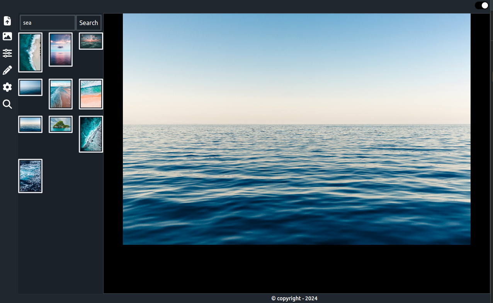

# Chhavi(Image) Editor

## Overview

**Chhavi(Image)** editor is a powerful and user-friendly web application designed to provide a comprehensive suite of image editing tools. It caters to both novice users and advanced professionals, offering a range of features that allow for detailed image manipulation and enhancement.

For more information, visit our [website](https://chhavie-ditor.netlify.app/).

## Key Features

### Adjustments
- **Brightness:** Easily adjust the brightness of s to bring out hidden details or create dramatic effects. The slider allows for precise control from 0% to 200%.
- **Contrast:** Modify the contrast to enhance the differences between light and dark areas. The tool offers fine-tuned adjustments for optimal image quality.
- **Saturation:** Control the intensity of colors in , from a muted grayscale to vibrant, saturated hues.

### Filters
- **Blur:** Apply a blur effect to s to soften edges and create artistic effects. The blur intensity can be adjusted from 0px to 10px.
- **Invert:** Invert the colors of  for a unique, high-contrast look. This filter is perfect for creating striking visual effects.

### Drawing Tools
- **Pen Tool:** Use the pen tool for freehand drawing and annotations. Customize the pen color, size, and opacity to suit your needs. Ideal for adding personal touches or highlighting specific areas of .

## User Interface
The image editor features an intuitive and responsive interface, allowing users to easily navigate through the various tools and options. The layout is designed to maximize workspace and provide quick access to frequently used features.

## Performance
Optimized for performance, the editor ensures smooth and efficient image processing. Leveraging modern web technologies, it provides real-time previews and adjustments without significant delays.

## Flexibility and Customization
With a flexible data structure for tools and settings, the editor can be easily extended with new features and customizations. Whether you're adjusting a simple photo or creating complex digital art,  editor adapts to your workflow.

## Cross-Platform Compatibility
Accessible from any modern web browser,  editor supports a wide range of devices, including desktops, tablets, and smartphones. This ensures that users can edit images on-the-go without compromising functionality.

## Conclusion
Chhavi(Image) editor combines ease of use with advanced features, making it a versatile tool for anyone looking to edit and enhance their images. Its robust set of tools, combined with a sleek interface and high performance, sets it apart as a premier choice for image editing needs.
